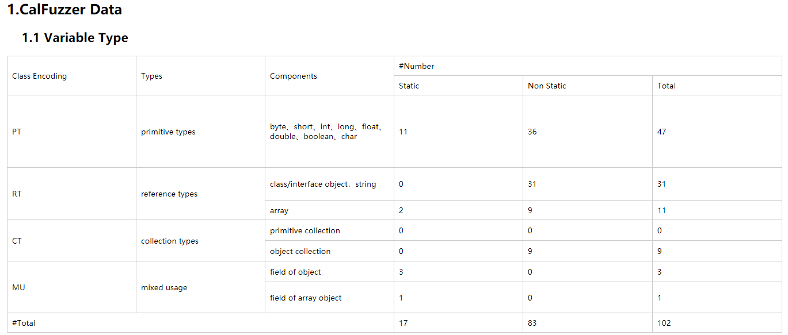
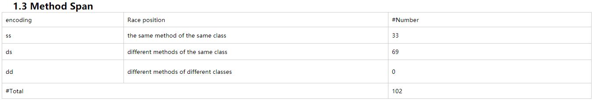
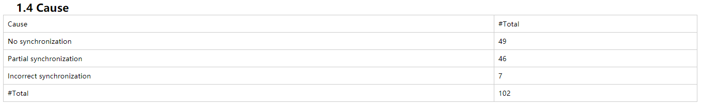
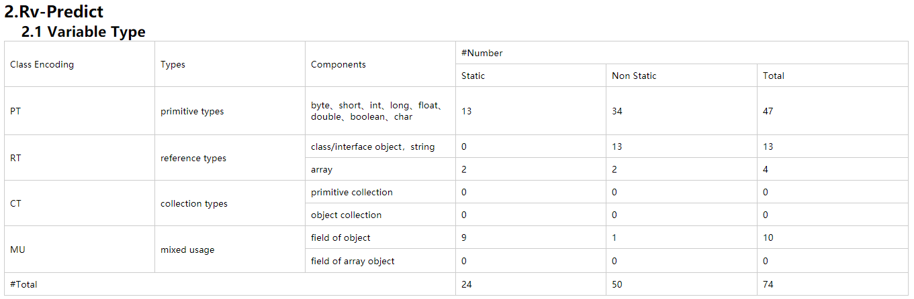
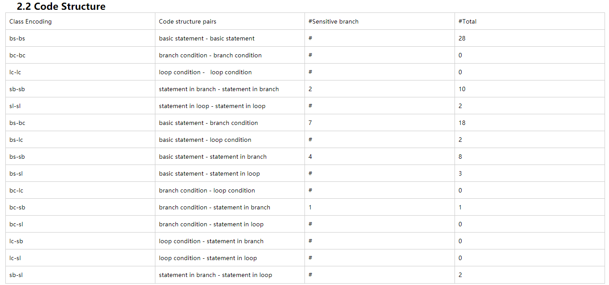
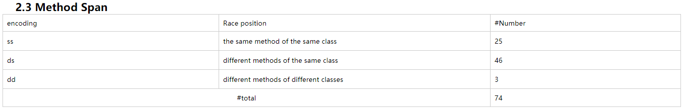
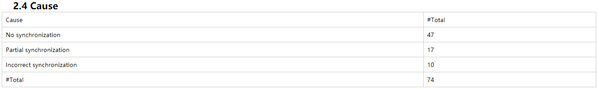
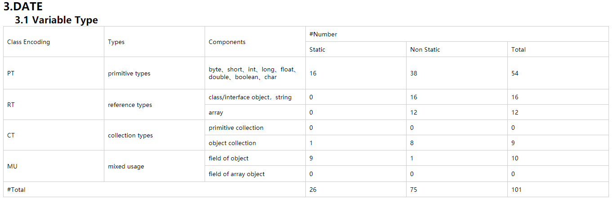
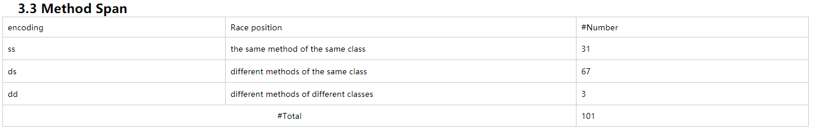
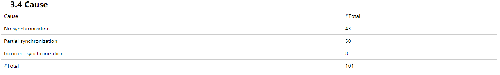

The analysis data is for the Race Detection Ability (subsection D) of Section IV in paper.  
We show the analysis data of the three programs in turn. The analysis data contains four aspects: variable type, code structure, method span and cause.  This is the statistics for undetected data races of each tools.

The four aspects for the section VI in paper are variable type, code structure, method span, cause.
- variable type:  We referred to the Java data type, combined with data race, then divided the variable type into four categories: primitive types, reference types, collection types and mixed usage.
- code structure: Taking into account the control flow structure of Java program language, the following code structures are related to data race: basic statements, branch conditions, statements in branch, loop conditions and statements in loop.
- method span: We divide the race locations into three categories: the same method of the same class, different methods of the same class, different methods of different classes.
- cause: In term of synchronization operations, we can divide them into three categories: no synchronization, partial synchronization and incorrect synchronization.

# The followings are the results for CalFuzzer:

## variable Type

## code structure

## method span

## cause

# The followings are the results for RV-Predict:

## variable Type

## code structure

## method span

## cause

The followings are the results for DATE:

## variable Type

## code structure

## method span

## cause

